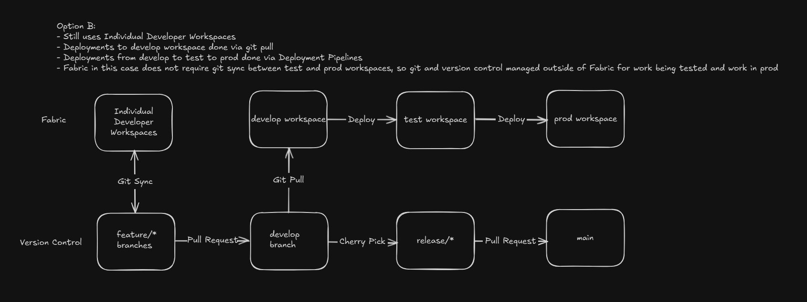
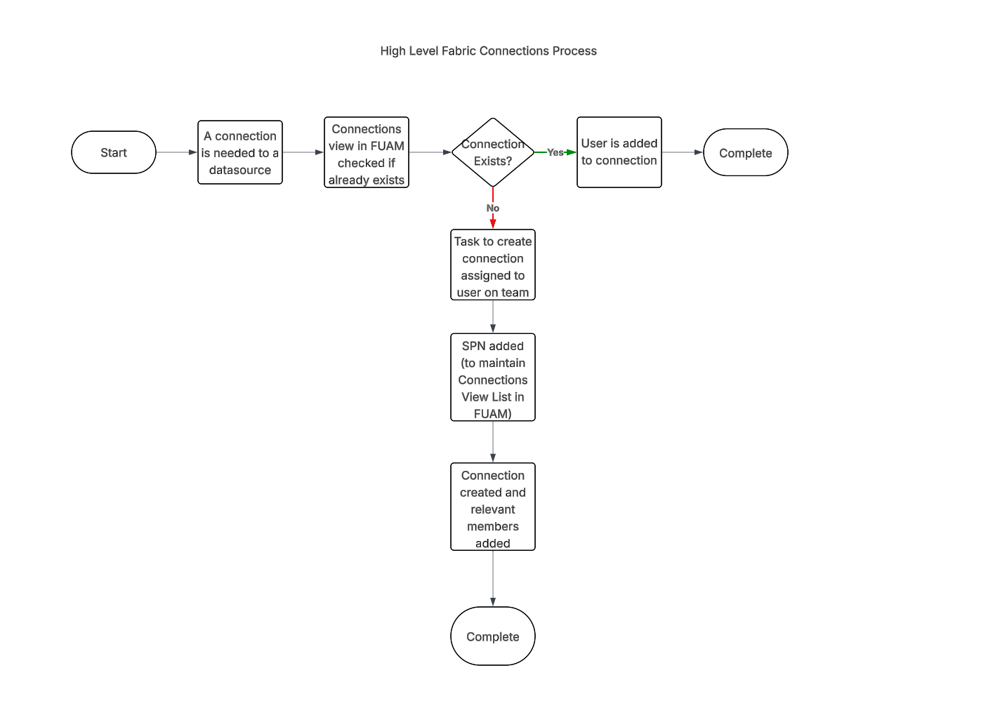

# Introduction 

# Getting Started
Review the Repo here: https://github.com/microsoft/fabric-cicd  
and github-pages here: https://microsoft.github.io/fabric-cicd/latest/  

# Build and Test
TODO: Describe and show how to build your code and run the tests. 

# Options
Automated Process  

Leveraging Deployment Pipelines  

# Additional
Fabric Connections Process  
  

Task to Create Connection Assigned to user on team can be automated via: https://learn.microsoft.com/en-us/rest/api/fabric/core/connections/create-connection?tabs=HTTP  

Task to add SPN to connection can be automated via: https://learn.microsoft.com/en-us/rest/api/fabric/core/connections/get-connection-role-assignment?tabs=HTTP  

