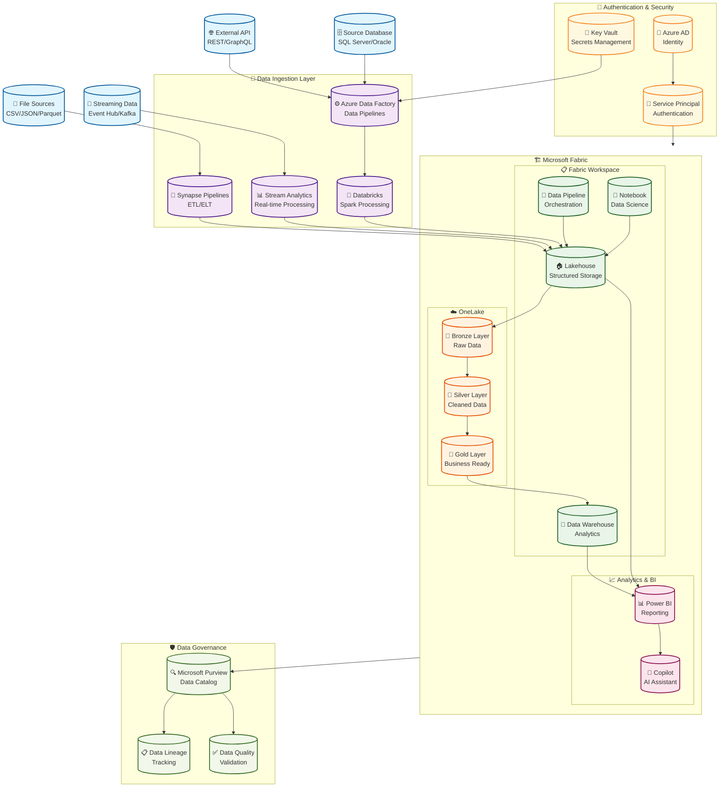

```mermaid
flowchart TD
    %% External Data Sources
    API[("🌐 External API<br/>REST/GraphQL")]
    DB[("🗄️ Source Database<br/>SQL Server/Oracle")]
    FILES[("📁 File Sources<br/>CSV/JSON/Parquet")]
    STREAM[("📡 Streaming Data<br/>Event Hub/Kafka")]
    
    %% Ingestion Layer
    subgraph INGESTION ["🔄 Data Ingestion Layer"]
        ADF[("⚙️ Azure Data Factory<br/>Data Pipelines")]
        SYNAPSE[("🔧 Synapse Pipelines<br/>ETL/ELT")]
        STREAM_ANALYTICS[("📊 Stream Analytics<br/>Real-time Processing")]
        DATABRICKS[("🧮 Databricks<br/>Spark Processing")]
    end
    
    %% Authentication & Security
    subgraph AUTH ["🔐 Authentication & Security"]
        KV[("🔑 Key Vault<br/>Secrets Management")]
        AAD[("👤 Azure AD<br/>Identity")]
        SPN[("🤖 Service Principal<br/>Authentication")]
    end
    
    %% Microsoft Fabric Components
    subgraph FABRIC ["🏗️ Microsoft Fabric"]
        direction TB
        
        subgraph WORKSPACE ["📋 Fabric Workspace"]
            LAKEHOUSE[("🏠 Lakehouse<br/>Structured Storage")]
            WAREHOUSE[("🏢 Data Warehouse<br/>Analytics")]
            NOTEBOOK[("📓 Notebook<br/>Data Science")]
            PIPELINE[("🔄 Data Pipeline<br/>Orchestration")]
        end
        
        subgraph ONELAKE ["☁️ OneLake"]
            direction LR
            BRONZE[("🥉 Bronze Layer<br/>Raw Data")]
            SILVER[("🥈 Silver Layer<br/>Cleaned Data")]
            GOLD[("🥇 Gold Layer<br/>Business Ready")]
        end
        
        subgraph ANALYTICS ["📈 Analytics & BI"]
            POWERBI[("📊 Power BI<br/>Reporting")]
            COPILOT[("🤖 Copilot<br/>AI Assistant")]
        end
    end
    
    %% Data Governance
    subgraph GOVERNANCE ["🛡️ Data Governance"]
        PURVIEW[("🔍 Microsoft Purview<br/>Data Catalog")]
        LINEAGE[("📋 Data Lineage<br/>Tracking")]
        QUALITY[("✅ Data Quality<br/>Validation")]
    end
    
    %% Connections and Flow
    API --> ADF
    DB --> ADF
    FILES --> SYNAPSE
    STREAM --> STREAM_ANALYTICS
    
    ADF --> DATABRICKS
    SYNAPSE --> LAKEHOUSE
    STREAM_ANALYTICS --> LAKEHOUSE
    DATABRICKS --> LAKEHOUSE
    
    %% Authentication flows
    KV --> ADF
    AAD --> SPN
    SPN --> FABRIC
    
    %% Fabric internal flows
    LAKEHOUSE --> BRONZE
    BRONZE --> SILVER
    SILVER --> GOLD
    
    PIPELINE --> LAKEHOUSE
    NOTEBOOK --> LAKEHOUSE
    
    GOLD --> WAREHOUSE
    WAREHOUSE --> POWERBI
    LAKEHOUSE --> POWERBI
    
    POWERBI --> COPILOT
    
    %% Governance flows
    FABRIC --> PURVIEW
    PURVIEW --> LINEAGE
    PURVIEW --> QUALITY
    
    %% Styling
    classDef apiClass fill:#e1f5fe,stroke:#01579b,stroke-width:2px
    classDef ingestionClass fill:#f3e5f5,stroke:#4a148c,stroke-width:2px
    classDef fabricClass fill:#e8f5e8,stroke:#1b5e20,stroke-width:2px
    classDef storageClass fill:#fff3e0,stroke:#e65100,stroke-width:2px
    classDef analyticsClass fill:#fce4ec,stroke:#880e4f,stroke-width:2px
    classDef governanceClass fill:#f1f8e9,stroke:#33691e,stroke-width:2px
    classDef authClass fill:#fff8e1,stroke:#f57f17,stroke-width:2px
    
    class API,DB,FILES,STREAM apiClass
    class ADF,SYNAPSE,STREAM_ANALYTICS,DATABRICKS ingestionClass
    class LAKEHOUSE,WAREHOUSE,NOTEBOOK,PIPELINE fabricClass
    class BRONZE,SILVER,GOLD storageClass
    class POWERBI,COPILOT analyticsClass
    class PURVIEW,LINEAGE,QUALITY governanceClass
    class KV,AAD,SPN authClass
```
